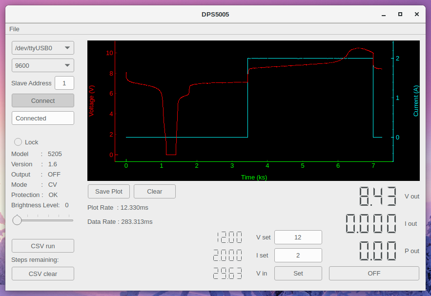

# DPS5005_pyGUI
A python GUI to display &amp; control DPS5005 power supply

* Hardware: DPS5005
* Software: v1.6

Additional settings within hardware:
* hold 'up' arrow while powering on to access interface setup area. 
* Modbus unit ID, baud rate, BT pin etc. 
* Press 'set' twice in succession to exit.
- note: baud rate 2400 & 19200 does not appear to work. 4800 & 9600 OK.

## Program:
What can it do:
* connect to serial port
* switch output ON/OFF
* set voltage & current levels
* display voltage & current in chart
* export voltage & current from chart as *.CSV
* adjust brightness
* lock hardware buttons
* load and run *.CSV file (time, voltage & current)

## Serial port:
* select port
* select baud rate (must match hardware configuation)
* select slave address (must match hardware configuation)
* Connect (status window shows 'Connected' good, 'Try again !!!' bad)
(only tested in linux but should work with windows)

## CSV
'Sample.csv' is provided as an example.
File -> Open, to load pre-configured *.CSV file, it then displays number of remaining steps.
Select 'CSV run' to action the file. Select 'CSV clear' to remove unwanted remaining steps.

## Requirements:
minimalmodbus library from: https://github.com/pyhys/minimalmodbus

## Developed with:
* dps_GUI.ui         - QT designer v5.9.2
* dps_GUI_program.py - Python 2.7.14
* dps_modbus.py      - Python 2.7.14
* dps5005_limits.ini - text file
