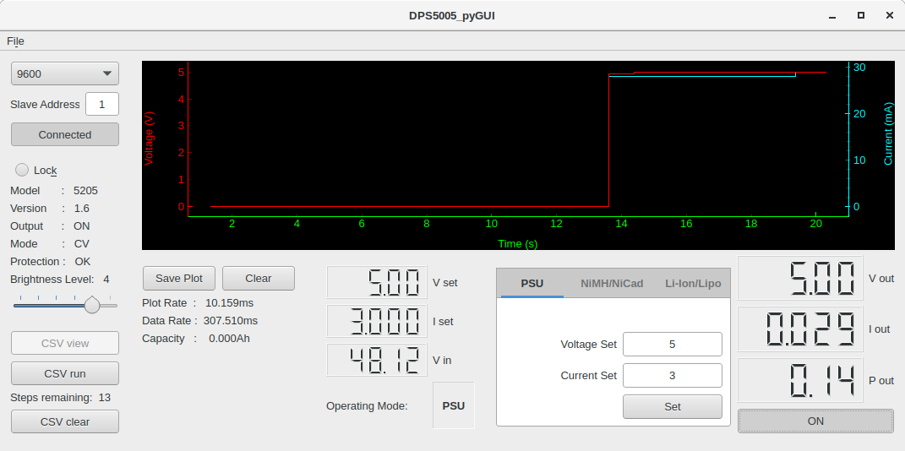
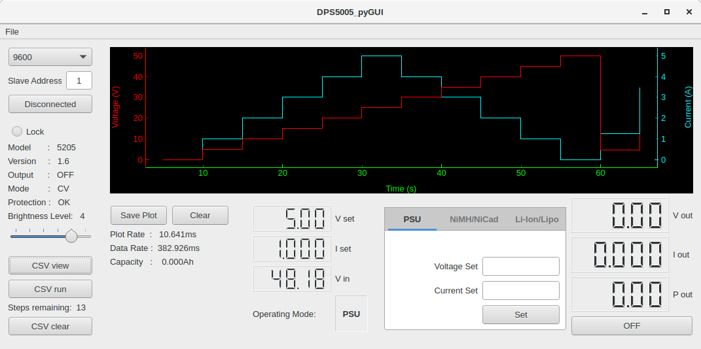

# DPS5005_pyGUI
A python GUI to display &amp; control DPS5005 power supply

* Hardware: DPS5005
* Software: v1.6

Additional settings within hardware:
* hold 'up' arrow while powering on to access interface setup area. 
* Modbus unit ID, baud rate, BT pin etc. 
* Press 'set' twice in succession to exit.
- note: baud rate 2400 & 19200 does not appear to work. 4800 & 9600 OK.

## Program:
What can it do:
* connect to serial port
* switch output ON/OFF
* set voltage & current levels
* display voltage &amp; current in chart
* export voltage &amp; current from chart as *.CSV
* adjust brightness
* lock hardware buttons
* load, view and run *.CSV file (time, voltage & current)
* Added battery charge capability



## Serial port:
* select baud rate (must match hardware configuration)
* select slave address (must match hardware configuration)
* Connect - automatically searches and connects to port (button status shows 'Connected' or 'Disconnected')
(only tested in linux but should work with windows)



## CSV
CSV now has 2 functions:
1. Preconfigured files can be imported to allow automated output control of the PSU. 
'Sample.csv' is provided as an example.
File -> Open, to load pre-configured *.CSV file, it then displays number of remaining steps.
Select 'CSV run' to action the file. Select 'CSV clear' to remove unwanted remaining steps.

2. Imported CSV files can be viewed prior to Serial port connection using ‘CSV view’ button. This function is unavailable when Serial communications is established.

## PSU 
Basic Power supply mode
* set Voltage limit
* set Current limit
* press 'Set' to load parameters then 'ON' to begin

## Battery Charging
NiCad/NiMH - based on (-dV) negative delta V or better known as Peak Detect.
* set absolute maximum safe charging voltage 'Voltage Max'
* set 'Constant Current'
* set 'Terminate (-dV)'
* press 'Set' to load parameters then 'ON' to begin

Li-Ion/Lipo - based CCCV using taper current as termination.
* set 'Constant Voltage'
* set 'Constant Current'
* set 'Terminate (A)'
* press 'Set' to load parameters then 'ON' to begin

Note: Termination control begins 5seconds after charge start allowing current to stabilise.

Check out http://batteryuniversity.com for more information.

Disclaimer: User is responsible for safety. Program allows flexibility choose your values carefully.

## Using other 'DPSxxxx' units
Configuring this program for other 'DPSxxxx' units should hopefully be straight forward to achieve by modifying the parameters within this file 'dps5005_limits.ini'. 
* adjust the safety levels, Max/Min values
* adjust the decimal point position

## Chart colours
The background, axis & pen colours and line (pen) width may be manipulated within the Section Three of the 'dps5005_limits.ini' file. Two examples exist.
* background colour
* axis colour
* pen colour
* pen weight

## Requirements:
```
pip install serial
pip install minimalmodbus
pip install pyqt5
pip install pyqtgraph
```
```
if using python2.7 
pip install configparser
```

## Developed with:
* dps_GUI.ui         - QT designer v5.9.2
* dps_GUI_program.py - Python 2.7.14
* dps_modbus.py      - Python 2.7.14
* dps5005_limits.ini - text file

## Download & run:
```
git clone https://github.com/lambcutlet/DPS5005_pyGUI
```
```
cd DPS5005_pyGUI/source_files/
```
```
python dps_GUI_program.py
```
